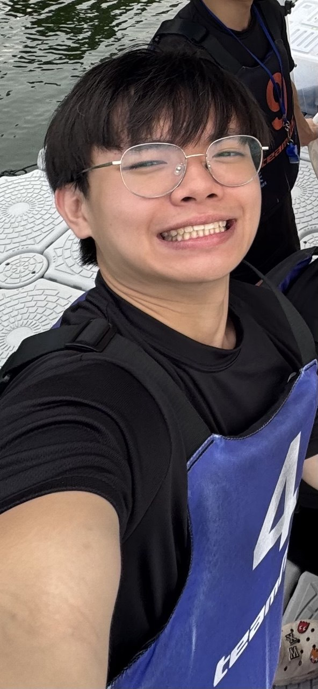
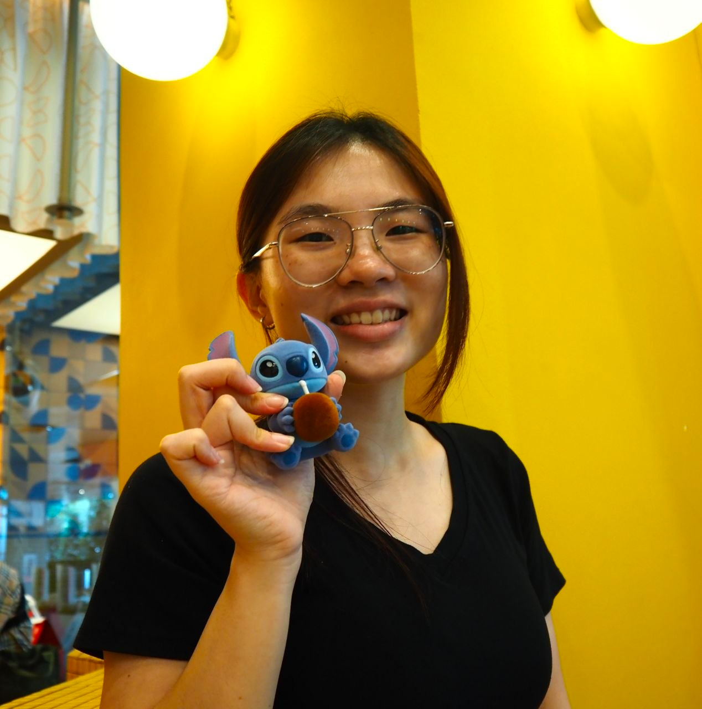

We are a team based in the [School of Computing, National University of Singapore](https://www.comp.nus.edu.sg).

You can reach us at the email `seer[at]comp.nus.edu.sg`

## Project team

### Eng Sheng

[[github](https://github.com/engsheng)]

* Role: Project Advisor

### Zhi Kai

[[github](http://github.com/Zhikai-Koh)]

* Role: Team Lead
* Responsibilities: UI

### Xin Yang

[[github](http://github.com/kong-xin-yang)] 

* Role: Developer
* Responsibilities: Data

### Xuen Yin

[[github](http://github.com/Xuenyin)]

* Role: Developer
* Responsibilities: Dev Ops + Threading

### Hai

[[github](https://github.com/Kubogi)]

* Role: Developer
* Responsibilities: UI
