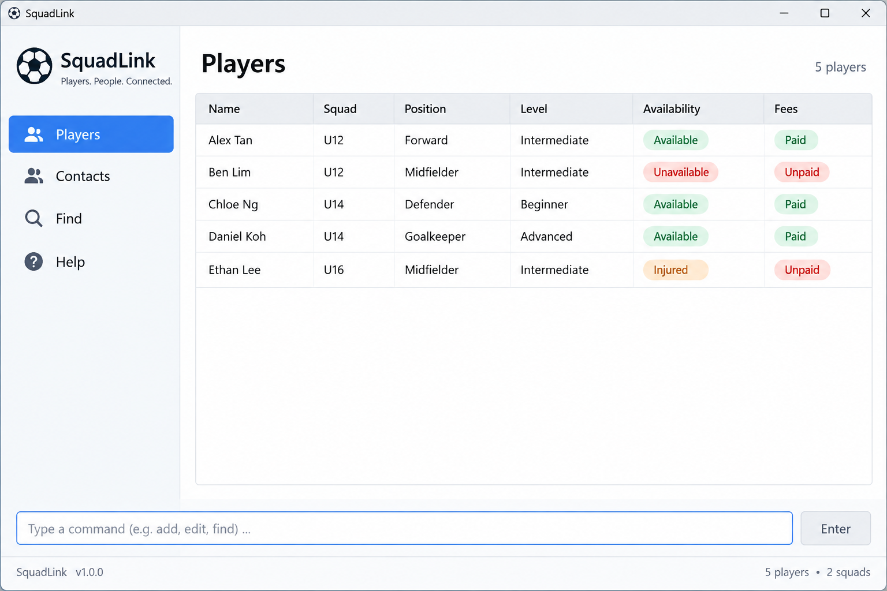

AddressBook Level 3 (AB3) is a **desktop application for managing contacts, optimized for use through a Command Line Interface (CLI)** while retaining the benefits of a Graphical User Interface (GUI). If you type quickly, AB3 can help you manage contacts faster than traditional GUI applications.

* Table of Contents
{:toc}

--------------------------------------------------------------------------------------------------------------------

## Quick start

1. Ensure that Java `25` or later is installed on your computer. 
   **Mac users:** Ensure you have the precise JDK version prescribed [here](https://se-education.org/guides/tutorials/javaInstallationMac.html).

1. Download the latest `.jar` file from [here](https://github.com/se-edu/addressbook-level3/releases).

1. Copy the file to the folder you want to use as the _home folder_ for your AddressBook.

1. Open a terminal, `cd` to the folder containing the JAR file, and run `java -jar addressbook.jar`. 
   A GUI similar to the one below should appear in a few seconds. Note how the app contains some sample data. 
   

1. Type a command in the command box and press Enter to execute it. For example, type **`help`** and press Enter to open the help window. 
   Some example commands you can try:

   * `list` : Lists all contacts.

   * `add n/John Doe` : Adds a contact named `John Doe` to the Address Book.

     For `add`, you can use `name/John Doe` instead of `n/John Doe`.

   * `delete 3` : Deletes the 3rd contact shown in the current list.

   * `clear` : Deletes all contacts.

   * `exit` : Exits the app.

1. Refer to the [Features](#features) section below for details of each command.

--------------------------------------------------------------------------------------------------------------------

## Features

**:information_source: Notes about the command format:** 

* Words in `UPPER_CASE` are the parameters to be supplied by the user. 
  For example, in `add n/NAME`, replace `NAME` with a value such as `John Doe`.

* Items in square brackets are optional. 
  For example, `n/NAME [t/TAG]` can be used as `n/John Doe t/friend` or as `n/John Doe`.

* Items followed by `…`​ can appear zero or more times. 
  For example, `[t/TAG]…​` may be omitted, or written as `t/friend` or `t/friend t/family`.

* Parameters can be in any order. 
  For example, if the command specifies `n/NAME t/TAG`, `t/TAG n/NAME` is also acceptable.

* Extraneous parameters for commands that take no parameters, such as `help`, `list`, `exit`, and `clear`, are ignored. 
  For example, `help 123` is interpreted as `help`.

* If you are using a PDF version of this document, be careful when copying and pasting commands that span multiple lines as space characters surrounding line-breaks may be omitted when copied over to the application.

### Viewing help: `help`

Shows a message explaining how to access the help page.

Format: `help`

### Adding a person: `add`

Adds a person to the address book.

Format: `add n/NAME [t/TAG]…​`

* For `add`, `name/` is an alias for `n/`. Both prefixes accept the same name values and validation rules.
* Specify the name exactly once. Repeating `n/`, repeating `name/`, or using both is rejected, even if the values match.
* Name is required with either name prefix. Parameters can appear in any order.
* This alias applies to `add` only; use `n/` when editing a name with `edit`.
* Player phone number, email and address are no longer stored. The former `p/`, `e/` and `a/` parameters are rejected.
* New players currently receive squad and position `Unassigned`, guardian name `Not provided`, guardian number `000`,
  and availability `available`. These fields cannot be supplied through `add` yet.

:bulb: **Tip:**
A person can have any number of tags, including zero.

Examples:
* `add n/John Doe`
* `add name/John Doe`
* `add n/Betsy Crowe t/friend t/criminal`

### Listing all persons: `list`

Shows a list of all persons in the address book.

Format: `list`

### Editing a person: `edit`

Edits an existing person in the address book.

Format: `edit INDEX [n/NAME] [t/TAG]…​`

* Edits the person at the specified `INDEX`. The index refers to the index number shown in the displayed person list. The index **must be a positive integer** 1, 2, 3, …​
* At least one of the optional fields must be provided.
* Existing values will be updated to the input values.
* Only name and tags can be edited with this command. Player phone number, email and address are no longer supported.
* When editing tags, all of the person's existing tags are removed; adding tags is not cumulative.
* To remove all of a person's tags, enter `t/` without a tag after it.

Examples:
*  `edit 1 n/John Doe` Edits the name of the 1st person to be `John Doe`.
*  `edit 2 n/Betsy Crower t/` Edits the name of the 2nd person to be `Betsy Crower` and clears all existing tags.

### Locating persons by name: `find`

Finds persons whose names contain any of the given keywords.

Format: `find KEYWORD [MORE_KEYWORDS]`

* The search is case-insensitive; for example, `hans` matches `Hans`.
* Keyword order does not matter; for example, `Hans Bo` matches `Bo Hans`.
* The search considers only names.
* Only full words match; for example, `Han` does not match `Hans`.
* Persons matching at least one keyword are returned (an `OR` search); for example, `Hans Bo` returns `Hans Gruber` and `Bo Yang`.

Examples:
* `find John` returns `john` and `John Doe`
* `find alex david` returns `Alex Yeoh`, `David Li` 
  

### Filtering players: `filter`

Displays registered players that match a squad, availability, or both.

Formats:

* `filter /squad SQUAD_NAME [/availability true|false]`
* `filter /availability true|false [/squad SQUAD_NAME]`

Short forms are also accepted: `sn/SQUAD_NAME` for `/squad SQUAD_NAME`, and `av/true` or `av/false`
for `/availability true|false`.

* Supply at least one criterion. Criteria can appear in either order, but each criterion can appear only once.
  Long and short forms count as the same criterion.
* A squad name must not be blank. Squad matching is case-sensitive; surrounding whitespace is ignored, while
  whitespace within the name is preserved.
* Availability accepts `true` or `false`, ignoring case and surrounding whitespace. `true` matches players stored
  as `available`; `false` matches players stored as `unavailable`.
* When both criteria are supplied, a player must satisfy both. If no players match, the result is
  `No matching players found!`.
* Results replace the currently displayed list and use its normal consecutive indexes. Those indexes can be used
  immediately with `delete`.
* Unknown filter prefixes and text before the first criterion are rejected as an invalid command format.

Examples:

* `filter /squad Soccer Stars`
* `filter /availability true`
* `filter /availability true /squad Football Fellas`
* `filter sn/Soccer Stars av/false`

### Deleting players: `delete`

Deletes one or more players from the address book.

Formats:

* By displayed index: `delete INDEX [INDEX]...`
* By full name: `delete /name NAME[, NAME]...`

**Deleting by index**

* Separate indices with spaces or tabs. Each index refers to the currently displayed player list.
* All indices refer to the list before the command runs. Deleting one player does not shift the other requested targets.
* Repeated indices delete the same player only once. For example, `delete 2 02` deletes only player 2.
* If any argument is invalid or any index is outside the displayed list, no players are deleted.
  The error identifies the invalid index and the available range. If no players are displayed, use `list` first.
* Remaining players keep their relative order and are renumbered.
* The index **must be a positive integer** 1, 2, 3, …​

**Deleting by name**

* Use `/name` once, followed by full names separated by commas. `/NAME` is also accepted.
* Name matching searches all registered players, including players hidden by a filter.
* Matching ignores capitalization and surrounding whitespace, and treats repeated whitespace as a single space.
* Partial names do not match. If a name is missing or matches multiple players, nobody is deleted.
* If a name matches multiple players, the message shows every matching player's details with a number.
  The displayed list switches to those matches, including any previously hidden by a filter.
  Use `delete 1` to delete the first match, or `delete 1 2` to delete both of the first two matches.
  These numbers refer to the matching list; if you change the displayed list, use its new indices.
* If a batch contains an ambiguous name, none of the requested players are deleted. Only matches for the first
  ambiguous name are shown; submit any other intended deletions again after resolving that name.
* Repeating a name deletes that player only once.
* Do not mix index selectors with name selectors. After `/name`, numbers are names, not indices.
* Empty entries, such as `John Doe,,Amy Tan` or a trailing comma, are rejected.
* Commas always separate names; quotation marks do not escape them.
* Player names currently support only letters, digits, and spaces when adding players. Creating players with punctuation
  in their names is not yet supported.

Examples:

* `list` followed by `delete 2` deletes the 2nd person in the address book.
* `list` followed by `delete 2 4` deletes the players originally shown at indices 2 and 4.
* `find Betsy` followed by `delete 1` deletes the 1st person in the results of the `find` command.
* `delete 1 abc` reports a non-numeric index and deletes nobody.
* `delete /name John Doe, Amy Tan` deletes both players if each name identifies exactly one registered player.
* `delete /name 17` selects a player whose full name is `17`.

### Clearing all entries: `clear`

Clears all entries from the address book.

Format: `clear`

### Exiting the program: `exit`

Exits the program.

Format: `exit`

### Saving the data

AddressBook automatically saves data after every command. You do not need to save manually.

Older data files containing player phone numbers, emails and addresses can still be loaded. Those legacy fields are
ignored and omitted the next time the file is saved; player names and the remaining profile fields are retained.
Players in older files without squad or position receive the current `Unassigned` defaults.

### Editing the data file

AddressBook data is saved automatically as a JSON file `[JAR file location]/data/addressbook.json`. Advanced users are welcome to update data directly by editing that data file.

:exclamation: **Caution:**
If your changes make the data file invalid, AddressBook starts with an empty address book at the next run. The invalid file remains on disk until you run a command (AddressBook saves after every command). Still, we recommend backing up the file before editing it. 
Furthermore, certain edits can cause the AddressBook to behave in unexpected ways (e.g., if a value entered is outside of the acceptable range). Therefore, edit the data file only if you are confident that you can update it correctly.

### Archiving data files `[coming in v2.0]`

_Details coming soon ..._

--------------------------------------------------------------------------------------------------------------------

## FAQ

**Q**: How do I transfer my data to another computer? 
**A**: Install the app on the other computer and overwrite the data file it creates with the data file from your previous AddressBook home folder.

--------------------------------------------------------------------------------------------------------------------

## Known issues

1. **When using multiple screens**, if you move the application to a secondary screen, and later switch to using only the primary screen, the GUI will open off-screen. The remedy is to delete the `preferences.json` file created by the application before running the application again.
2. **If you minimize the Help Window** and then run the `help` command (or use the `Help` menu, or the keyboard shortcut `F1`) again, the original Help Window will remain minimized, and no new Help Window will appear. The remedy is to manually restore the minimized Help Window.

--------------------------------------------------------------------------------------------------------------------

## Command summary

Action | Format, Examples
--------|------------------
**Add** | `add n/NAME [t/TAG]…​` (`name/` can replace `n/`; specify the name once)   e.g., `add name/James Ho t/friend t/colleague`
**Clear** | `clear`
**Delete** | `delete INDEX [INDEX]...` or `delete /name NAME[, NAME]...`  e.g., `delete 1 3` or `delete /name John Doe, Amy Tan`
**Edit** | `edit INDEX [n/NAME] [t/TAG]…​`  e.g., `edit 2 n/James Lee`
**Find** | `find KEYWORD [MORE_KEYWORDS]`  e.g., `find James Jake`
**Filter** | `filter /squad SQUAD_NAME [/availability true|false]` or `filter /availability true|false [/squad SQUAD_NAME]`  e.g., `filter /squad Soccer Stars av/true`
**List** | `list`
**Help** | `help`
